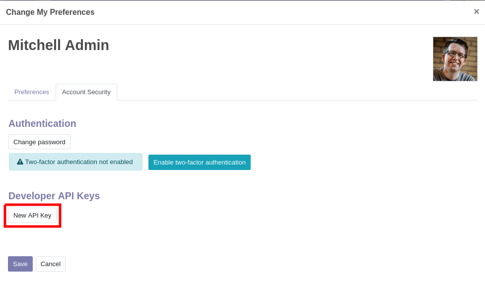

External API
============

### External API - XML RPC

Odoo is usually extended internally via modules, but many of its features and all of 
its data are also available from the outside for external analysis or integration with 
various tools. Part of the Model Reference API is easily available over XML-RPC and 
accessible from a variety of languages.

#### Configuration

##### If you already have an Odoo server installed, you can just use its parameters

For Odoo Online instances (\<domain\>.odoo.com), users are created
without a *local* password (as a person you are logged in via the Odoo
Online authentication system, not by the instance itself). To use
XML-RPC on Odoo Online instances, you will need to set a password on the
user account you want to use:

-   Log in your instance with an administrator account
-   Go to `Settings --> Users & Companies --> Users`
-   Click on the user you want to use for XML-RPC access
-   Click on `Action` and select
    `Change Password`
-   Set a `New Password` value then
    click `Change Password`.

The *server url* is the instance\'s domain (e.g.
*https://mycompany.odoo.com*), the *database name* is the name of the
instance (e.g. *mycompany*). The *username* is the configured user\'s
login as shown by the *Change Password* screen.

```python3
url = <insert server URL>
db = <insert database name>
username = 'admin'
password = <insert password for your admin user (default: admin)>
```

#### API Keys 14.0

Odoo has support for **api keys** and (depending on modules or settings)
may **require** these keys to perform webservice operations.

The way to use API Keys in your scripts is to simply replace your
**password** by the key. The login remains in-use. You should store the
API Key as carefully as the password as they essentially provide the
same access to your user account (although they can not be used to
log-in via the interface).

In order to add a key to your account, simply go to your
`Preferences` (or
`My Profile`):

<p align="center" width="100%">
     
</p>

then open the `Account Security` tab,
and click `New API Key`:

<p align="center" width="100%">
     
</p>

Input a description for the key, **this description should be as clear
and complete as possible**: it is the only way you will have to identify
your keys later and know whether you should remove them or keep them
around.

Click `Generate Key`, then copy the
key provided. **Store this key carefully**: it is equivalent to your
password, and just like your password the system will not be able to
retrieve or show the key again later on. If you lose this key, you will
have to create a new one (and probably delete the one you lost).

Once you have keys configured on your account, they will appear above
the `New API Key` button, and you
will be able to delete them:

<p align="center" width="100%">
     
</p>

**A deleted API key can not be undeleted or re-set**. You will have to
generate a new key and update all the places where you used the old one.
